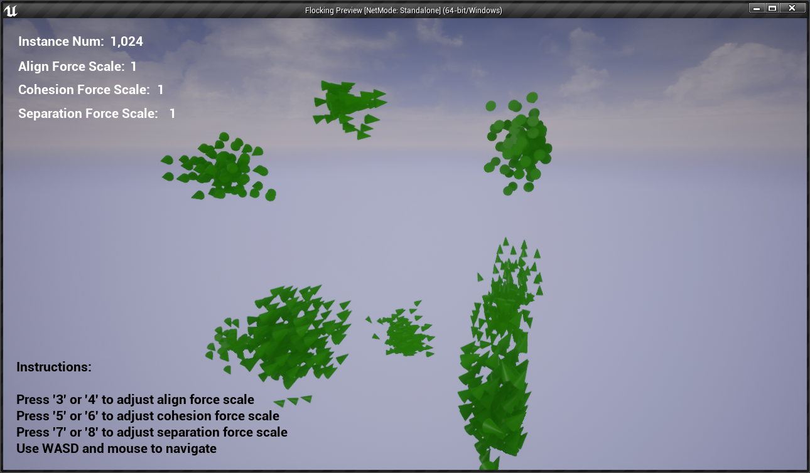

# UE4 GPGPU Flocking/Boids  NoInstancedStaticMesh branch

This DEMO used GPGPU (compute shader) to implement boids algorithm in UE4. This version draws boids by using static mesh.

## Playing instruction
Using **AWSD** and mouse (the typical FPS control) to navigate the scene.   
I also provide interface allowing players to change the parameter of the boids and play with them.
1. Press **'3' or '4'** to adjust align force scale
2. Press **'5' or '6'** to adjust cohesion force scale
3. Press **'7' or '8'** to adjust separation force scale

## Implementation description
### 1.	Rendering boids
Using static mesh.
### 2.	Applying GPGPU (compute shader) to update boids
Thanks for the wonderful tutorial from [@Temaran](https://github.com/Temaran), I applied compute shader to calculate velocity and position for boids in this branch of repo.
Compute shader is imported as a plugin. Velocity and position information are saved in renderTarget2Ds which is similar to master branch, but this time we use compute shader to do calculation for it and use customized vertex and fragment shader to upate the renderTarget2Ds.

## Future works
Using spatial hashing algorithm to do optimization and achieve more boids.

## References
[THE NATURE OF CODE Chapter 6. Autonomous Agents](https://natureofcode.com/book/chapter-6-autonomous-agents/)   
[Manipulate 125,000 Cubes with GPGPU - Unreal Engine 4](https://www.youtube.com/watch?v=LQBgJBC0jhE)   
[[UE4]ブループリントだけでGPGPUをしよう ~ その1 インスタンスIDを割り振る ~](https://qiita.com/selflash/items/c937308299d93340f7c7)   
Many thanks to [@selflash](https://github.com/selflash) for helping me solve the problem of floating point texture accuracy!   
[Pixel and Compute Shaders in UE4](https://forums.unrealengine.com/development-discussion/c-gameplay-programming/29352-tutorial-pixel-and-compute-shaders-in-ue4)   
[500,000 boids simulated with a compute shader](https://www.reddit.com/r/Unity3D/comments/c874d9/500000_boids_simulated_with_a_compute_shader/)   
[Scalable GPU Fluid Simulation](https://wickedengine.net/2018/05/21/scalabe-gpu-fluid-simulation/)    
[FAST FIXED-RADIUS NEAREST NEIGHBORS:
INTERACTIVE MILLION-PARTICLE FLUIDS](http://on-demand.gputechconf.com/gtc/2014/presentations/S4117-fast-fixed-radius-nearest-neighbor-gpu.pdf)
